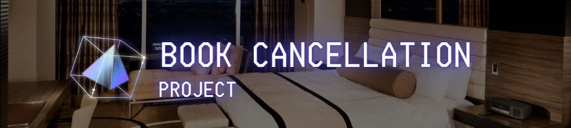

# 📂 Neural Networks Projects

Welcome to the section of my portfolio dedicated to projects involving **Artificial Neural Networks** and **Deep Learning**.

Here you'll find models built with frameworks like **TensorFlow**, **Keras**, and **PyTorch**, applied to real-world problems including classification, regression, and image recognition.

---

### 🏨 Booking Cancellation Prediction with Neural Networks
- **Description**: This project uses a Multilayer Perceptron (MLP) to predict whether a customer will cancel a hotel reservation.
- **Context**: Builds a classification model using artificial neural networks to analyze hotel booking data. Applies hyperparameter tuning (number of hidden layers, neurons, activation functions) and Dropout regularization to improve performance.
- **Tech**: `Python`,`Pandas`, `scikit-learn`, `TensorFlow `, `Keras`
- **Notebook**: [`BookCancellation_ANN.ipynb`](notebooks/BookCancellation_ANN.ipynb)
- **Dataset**: [`hotel_bookings.csv`](data/hotel_bookings.csv)

---

### 📵 Binary Classification with ANN and SMOTE
- **Description**: Predictive model using a fully connected ANN trained on imbalanced data, balanced using SMOTE.
- **Context**: The goal of this project is to predict **customer churn** in a telecommunications company using structured data. The dataset includes demographic information, services used, and customer account history.
- **Tech**: `Keras`, `SMOTE`, `RandomForest`, `scikit-learn`
- **Notebook**: [`CustomerChurn_BinaryClassification.ipynb`](notebooks/CustomerChurn_BinaryClassification.ipynb)
- **Dataset**: [`CustomerChurn.csv`](data/CustomerChurn.csv)

---

### 📷 Image Classification with CNN (coming soon)
- **Description**: Convolutional Neural Network trained on image data for multiclass classification.
- **Tech**: `TensorFlow`, `Keras`, `CNN`, `Matplotlib`

---

## 🧰 Tools & Libraries

  
  
  
  

---

## ✨ Goals

- ✅ Learn and document different NN architectures.
- ✅ Apply neural networks to tabular data and compare with classical models.
- 🔜 Explore CNNs and RNNs.
- 🔜 Deploy a model using Streamlit or Flask.

---

